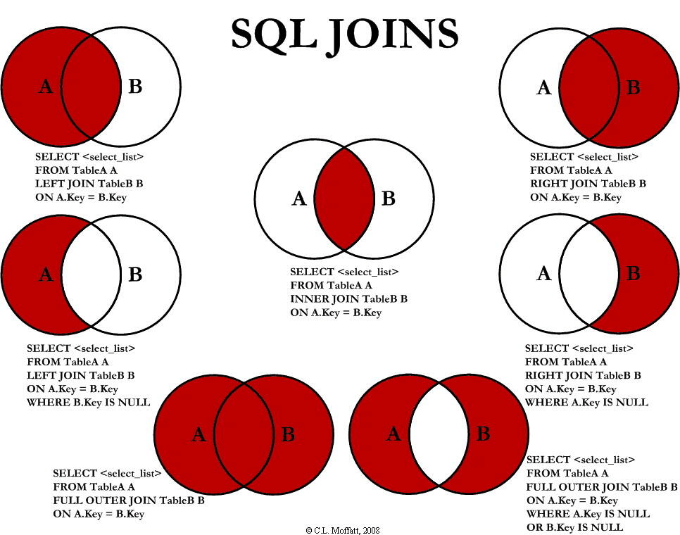

面试八股文
=====================================

[TOC]

## 计算机网络

### `TODO` TCP拥塞控制 

#### Reno算法

为简化描述，在接下来的描述中，假设发送的包大小都是SMSS(发送端最小报文段长度)

在完成三次握手后，进入慢启动阶段。慢启动阈值初始值可以被设置为一个不小于接收端通告窗口大小的值。拥塞窗口大小为10倍的SMSS。每当接收到一个好的ACK，拥塞窗口大小增加SMSS字节。

当拥塞窗口大小大于慢启动阈值时，进入拥塞避免阶段。

在拥塞避免阶段，每当收到好的ACK时，拥塞窗口大小增加 $\frac{SMSS}{cwnd}SMSS$字节。

当接收到三次重复的ACK后，执行快速重传算法，将慢启动阈值设为在外数据大小的一半。每接收到一个重复的ACK，拥塞窗口增大SMSS，当前已接受到三个重复的ACK，则拥塞窗口设为：新的慢启动阈值大小+3倍SMSS，当收到好的ACK后，拥塞窗口大小恢复为慢启动阈值大小，然后执行拥塞避免阶段。

当发生重传超时时，将慢启动阈值设为在外数据大小的一半，将拥塞窗口大小设置为初始窗口大小，重新开始慢启动过程。

和式增加，积式减小。在拥塞避免阶段和式增加，在发生重传后积式减小，可用如下公式表示
$$
\begin{cases}
    cwnd_{t+1}=cwnd_t + \alpha / cwnd_t  \\
    cwnd_{t+1}=cwnd_t - \beta cwnd_t
\end{cases}
$$

对于Reno算法。在拥塞避免阶段，每收到一个好的ACK，拥塞窗口增加 $1/cwnd_t$(此处的单位为窗口大小的倍数)，发生超时或快速重传时，拥塞窗口减为一半。则和增积减可以写为：

$$
\begin{cases}
    cwnd_{t+1}=cwnd_t + 1 / cwnd_t  \\
    cwnd_{t+1}=cwnd_t - 0.5 cwnd_t
\end{cases}
$$

#### CUBIC算法

当前Linux 默认的tcp 拥塞控制算法为CUBIC。

在拥塞窗口因为发生重传超时或快速重传减小前，窗口的最大值为$W_{max}$，由积式减小，窗口减小后，新的窗口和慢启动阈值被设置为$\beta W_{max}$(Linux中$\beta$的典型值为0.8)

对于CUBIC算法，在拥塞避免阶段有三次函数：

$$
    W(t)=C(t-K)^3+W_{max}
$$

其中：

- $C$是常数，一般取0.4，
- $t$距离最近一次窗口减小经过的时间

由
$$
\begin{cases}
    W(0) = \beta W_{max}  \\
    W(t)=C(t-K)^3+W_{max}
\end{cases}
$$
可以计算出:
$$
K=\sqrt[3]{\frac{\beta W_{max}}{C}}
$$

当$t<K$时，为稳定增长阶段，增长先快后慢；
当$t>K$时，为探测最大可用带宽的阶段，增长先慢后快

当接收到一个好的ACK时，窗口值增加为（这其实不重要）
$$
cwnd = cwnd + (W(t+RTT) - cwnd) / cwnd
$$


发送端实际可用窗口大小应接近于带宽延迟积 (Bandwidth-Delay Product, BDP), 即 RTT 与链路中最小通行速率(即发送端与接收端传输路径"瓶颈")的乘积。
$min(N, SMSS)$，其中，N为此好的ACK确认的字节数，好的ACK指此ACK大于之前接收到的ACK。

### TCP linger close

对未设置 linger close 的套接字调用 `close(fd)`：

- 首先检查接收缓冲区是否有未被应用层程序读取的数据，如果有，则全部丢弃，并向对面发送`RST`。这会导致对端丢弃所有尚在对端接收缓冲区未被对端应用层程序读取的数据。

- 如果接收缓冲区没有未被应用层程序读取的数据，则在发送完所有发送缓冲区的数据后，执行四次挥手和 **TIME_WAIT** 状态。对端是否成功收到这段数据，应用层程序已经无法知道了。

而调用`shutdown(fd, SHUT_WR)`，只关闭写方向，当前套接字不能再写入数据。发送缓冲区全部数据发送完毕后，只会发送 FIN 分节，而不会发送 RST分节。

**TIME_WAIT** 状态的一个目的是为了防止发生旧连接没有可靠断开，旧的连接和新的连接中的数据发生混淆的情况。在此阶段接收数据后，会返回一个 RST 分节。

http://www.serverframework.com/asynchronousevents/2011/01/time-wait-and-its-design-implications-for-protocols-and-scalable-servers.html

```c
struct linger {  
    int l_onoff //0=off, nonzero=on (开关)  
    int l_linger //linger time (延迟时间)  
}
```
`l_onoff`为非零值时，开启此项功能。
- `l_linger` 为 0, 直接发送 RST
- `l_linger` 非 0，则会阻塞一段时间，内核将阻塞应用程序（即使此套接字可能时非阻塞的），并以 l_linger 设定的延迟时间为周期不断尝试将发送缓冲区中的数据发出并等待对端 ACK，如果对端 ACK，则使用正常四次挥手流程关闭 socket 同时退出应用程序。

TODO：对于非阻塞的文件描述符的影响

### TCP 三次握手（Linux平台）

1. 发送端调用`connect()`，发送 `SYN`（同步）分节,进入`SYN_SENT`状态
2. 接收端接收到此`SYN`分节
   - 如果操作系统中处于`SYN_RCVD`状态的连接数目超过`net.ipv4.tcp_max_syn_backlog`，拒绝此连接。
   - 如果**backlog队列**中没有够空间分配给此连接，则会延迟对此`SYN`分节做出响应
   - 若未发生以上两种情况，接收端将此连接加入到监听套接字的**未完成连接队列**中，并发送一个`SYN`+`ACK`分节，进入`SYN_RECV`状态
3. 发送端接收到`SYN`+`ACK`分节，从阻塞的`connect()`函数返回，并发送一个`ACK`分节（未开启`defer accept`选项）进入`ESTABLISHED`状态
4. 接收端接收`ACK`，进入`ESTABLISHED`状态，并将此连接从监听套接字的**未完成连接队列**中移出并加入**backlog队列**（即**已完成连接队列**）中。接收端调用`accept4()`函数时，若**backlog队列**为空，则返回EAGAIN，不为空则移除并返回**backlog队列**的头部的连接

注：

- backlog队列长度由`listen`设置且不会超过`net.core.somaxconn`; 
- 若应用程序不知道连接已完成(未调用`accept`函数获得此连接的套接字)，客户端发送的数据会被存储在backlog队列中


### TCP 为什么需要三次握手

首先是更多次数。三次握手能完成的功能没必要用更多次数来实现

只有发送端有充足的信息判断此次连接的有效性，三次握手将是否建立连接的控制权交给了发送端。如果是两次握手，则是由接收端决定建立或拒绝此次连接。接收端没有充足的信息判断此次连接的有效性。在第二次握手后，发送端由第二次握手的确认号，判断此次连接的有效性：发送端因未能及时完成连接会在超时后重新开始三次握手，旧的初始序列号会过期而无效。而这些信息接收端无法知道。所以需要第三次握手，由发送端根据第二次握手的确认号判断此次连接是否是过期连接，并在第三次握手中发送`ACK`或者`RST`决定此次连接的有效性

### 三次挥手最后一次ACK报文未收到

服务端会在第一次接收到`SYN`后设置重传超时并发送`SYN`+`ACK`，若一段时间内未收到客户端发来的`ACK`，则会重复发送某些次数，之后关闭连接。客户端在发送最后一次ACK后会从函数connect调用中返回，应用程序认为连接建立，若发送信息，则服务端会返回`RST`

### `TODO`TCP 四次挥手

### 四次挥手中如果客户端发给服务器的最后一个报文丢失了会怎么样

如果是客户端主动关闭，则最后一个报文是服务器发来的FIN的ACK，如果丢失，则服务器在2MSL（时间不太确认）后，会继续发送FIN

如果是客户端被动关闭，最后一个报文是客户端发送的FIN，服务器无法返回此FIN的ACK，会继续发送

### DNS解析过程

执行以下命令

```shell
dig @8.8.8.8 +trace +additional stackoverflow.com
```

以下输出的结果只保留DNS的NS记录和A(AAAA)记录

1. 从`8.8.8.8`名称服务器中查询根域名`.`，接收报文中包含13个根级域名服务器

    ```shell
    .                       86639   IN      NS      m.root-servers.net.
    .                       86639   IN      NS      b.root-servers.net.
    .                       86639   IN      NS      c.root-servers.net.
    .                       86639   IN      NS      d.root-servers.net.
    .                       86639   IN      NS      e.root-servers.net.
    .                       86639   IN      NS      f.root-servers.net.
    .                       86639   IN      NS      g.root-servers.net.
    .                       86639   IN      NS      h.root-servers.net.
    .                       86639   IN      NS      a.root-servers.net.
    .                       86639   IN      NS      i.root-servers.net.
    .                       86639   IN      NS      j.root-servers.net.
    .                       86639   IN      NS      k.root-servers.net.
    .                       86639   IN      NS      l.root-servers.net.
    ```

2. 向每一个根域名服务器查询域名`com.`，从根域名服务器`m.root-servers.net`接收到如下报文，获得顶级域名`com.`所在多个顶级域名服务器
    ```shell
    com.                    172800  IN      NS      a.gtld-servers.net.
    com.                    172800  IN      NS      b.gtld-servers.net.
    com.                    172800  IN      NS      c.gtld-servers.net.
    com.                    172800  IN      NS      d.gtld-servers.net.
    com.                    172800  IN      NS      e.gtld-servers.net.
    com.                    172800  IN      NS      f.gtld-servers.net.
    com.                    172800  IN      NS      g.gtld-servers.net.
    com.                    172800  IN      NS      h.gtld-servers.net.
    com.                    172800  IN      NS      i.gtld-servers.net.
    com.                    172800  IN      NS      j.gtld-servers.net.
    com.                    172800  IN      NS      k.gtld-servers.net.
    com.                    172800  IN      NS      l.gtld-servers.net.
    com.                    172800  IN      NS      m.gtld-servers.net.
    a.gtld-servers.net.     172800  IN      A       192.5.6.30
    b.gtld-servers.net.     172800  IN      A       192.33.14.30
    c.gtld-servers.net.     172800  IN      A       192.26.92.30
    d.gtld-servers.net.     172800  IN      A       192.31.80.30
    e.gtld-servers.net.     172800  IN      A       192.12.94.30
    f.gtld-servers.net.     172800  IN      A       192.35.51.30
    g.gtld-servers.net.     172800  IN      A       192.42.93.30
    h.gtld-servers.net.     172800  IN      A       192.54.112.30
    i.gtld-servers.net.     172800  IN      A       192.43.172.30
    j.gtld-servers.net.     172800  IN      A       192.48.79.30
    k.gtld-servers.net.     172800  IN      A       192.52.178.30
    l.gtld-servers.net.     172800  IN      A       192.41.162.30
    m.gtld-servers.net.     172800  IN      A       192.55.83.30
    a.gtld-servers.net.     172800  IN      AAAA    2001:503:a83e::2:30
    b.gtld-servers.net.     172800  IN      AAAA    2001:503:231d::2:30
    c.gtld-servers.net.     172800  IN      AAAA    2001:503:83eb::30
    d.gtld-servers.net.     172800  IN      AAAA    2001:500:856e::30
    e.gtld-servers.net.     172800  IN      AAAA    2001:502:1ca1::30
    f.gtld-servers.net.     172800  IN      AAAA    2001:503:d414::30
    g.gtld-servers.net.     172800  IN      AAAA    2001:503:eea3::30
    h.gtld-servers.net.     172800  IN      AAAA    2001:502:8cc::30
    i.gtld-servers.net.     172800  IN      AAAA    2001:503:39c1::30
    j.gtld-servers.net.     172800  IN      AAAA    2001:502:7094::30
    k.gtld-servers.net.     172800  IN      AAAA    2001:503:d2d::30
    l.gtld-servers.net.     172800  IN      AAAA    2001:500:d937::30
    m.gtld-servers.net.     172800  IN      AAAA    2001:501:b1f9::30
    ```
            
3. 向上一步中获得的每一个顶级域名服务器查询域名`stackoverflow.com.`，从顶级域名服务器`c.gtld-servers.net`接收到如下信息

    ```shell
    stackoverflow.com.      172800  IN      NS      ns-358.awsdns-44.com.
    stackoverflow.com.      172800  IN      NS      ns-1033.awsdns-01.org.
    stackoverflow.com.      172800  IN      NS      ns-cloud-e1.googledomains.com.
    stackoverflow.com.      172800  IN      NS      ns-cloud-e2.googledomains.com.
    ns-358.awsdns-44.com.   172800  IN      A       205.251.193.102
    ns-cloud-e1.googledomains.com. 172800 IN AAAA   2001:4860:4802:32::6e
    ns-cloud-e1.googledomains.com. 172800 IN A      216.239.32.110
    ns-cloud-e2.googledomains.com. 172800 IN AAAA   2001:4860:4802:34::6e
    ns-cloud-e2.googledomains.com. 172800 IN A      216.239.34.110
    ```

    未查询到域名`stackoverflow.com.`的A或AAAA记录，所以要继续查询

4. 继续向上一步中的域名服务器中查询域名`stackoverflow.com.`的A记录，从`ns-1033.awsdns-01.org`收到以下信息

    ```shell
    stackoverflow.com.      300     IN      A       151.101.1.69
    stackoverflow.com.      300     IN      A       151.101.65.69
    stackoverflow.com.      300     IN      A       151.101.129.69
    stackoverflow.com.      300     IN      A       151.101.193.69
    stackoverflow.com.      172800  IN      NS      ns-1033.awsdns-01.org.
    stackoverflow.com.      172800  IN      NS      ns-358.awsdns-44.com.
    stackoverflow.com.      172800  IN      NS      ns-cloud-e1.googledomains.com.
    stackoverflow.com.      172800  IN      NS      ns-cloud-e2.googledomains.com.
    ```
    其中包含域名`stackoverflow.com.`的A记录，查询结束

注意，以上的NS记录中给出的是域名为不是地址。例如从`ns-358.awsdns-44.com.`查询`stackoverflow.com.`时，若上级域名服务器能查询到此域名服务器的地址，则会一同返回此域名服务器的A（或AAAA）记录，不需要重新解析。

### `TODO`DNS算法有哪些 

### `TODO`io密集型请求怎么处理，使用异步io

### `TODO`TCP报文字段有哪些，如何实现字节流控制

### TCP UDP区别

- UDP不提供差错纠正
- 由于无连接特征，开销更小，广播或组播更多使用这种协议
- TCP头部20字节 
  - 源端口号 目标端口号
  - 序列号
  - 确认号
  - 头部大小（单位4字节x15）各类标识 窗口大小
  - 校验和 紧急指针
- UPD头部8字节
  - 源端口号 目标端口号
  - 总长度 校验和 
- TCP面向流的 UDP面向字节的

### `TODO`TCP怎样保证可靠性

### `TODO`TCP/IP五层模型，端口号在哪一层指定

- 应用层：DNS HTTP协议
- 传输层：TCP UDP
- 网络层：ARP IP ICMP
- 数字链路层：MAC协议

### `TODO`TCP的最大连接数

### TCP MSS MTU

通过`ifconfig`指令可以看到，以太网最大传输单元和互联网路径最大传输单元`MTU`的典型数值为1500字节，IPv4头部20字节，IPv6头部40字节，所以TCP最大段大小`MSS`（TCP中的数据段大小（不考虑选项）为1460/1440字节。

在发送`SYN`时会告知对方自己的MSS大小，MSS表明自己不愿意在连接过程中接受大于该尺寸的报文段

**路径最大传输单元**：两台主机之间路径的所有网络报文段中MTU最小值，有助于TCP避免分片。*基于ICMP的路径最大传输单元发现 `PMTUD`如何实现*。`UDP`使用应用程序指定的段大小（面向段的），如果超过路径最大传输单元，则此UDP不满足可写条件。

### TCP选项

- MSS大小
- 选择确认
- 窗口缩放
- 时间戳、放绕回序号

### `TODO`TCP `TIME_WAIT`状态存在理由：

1. 可靠地实现TCP双全工连接的终止
2. 允许老的重复分解在网络中消逝。在关闭旧的连接，在相同的端口和IP间建立另一个新的连接，则前一个连接的还在网络中的数据在MSL后被丢弃，新的连接不会接受旧连接的数据
   
当处于此状态时，通信双方将此连接（客户端ip 客户端端口 服务端ip 服务端端口）定义为不可用状态，当只有当2MSL等待结束、或新连接初始序列号大于之前实例的最大序列号、或允许使用时间戳来区分新旧实例的报文段时，才能避免新旧连接实例的报文段混淆，这条链接才能重新使用。如果这些端口号被处于2MSL等待状态的连接中任意一端使用，则此端口号将不能被再次使用，bind一个现有连接的端口会失败。除非设置`SO_REUSEADDR`，TCP服务器都应设置此选项

若处于`TIME_WAIT`状态，通信双方将此连接(源IP地址 源端口 目的IP地址 目的端口)定义为不可重新使用。此连接可以再次被双方使用，应满足以下某一种条件:

- 2MSL等待结束
- 新连接使用的初始序列号超过连接之前的实例所使用的最高序列号
  *(待深入研究: 新的序列号不会和旧的未到达序列号重叠么)*
-  允许使用时间戳选项来区别之前的连接实例来避免混淆

由以上条件可以看出，`TIME_WAIT`目的之一为: **区分相同socket的新旧连接**

而实际上Unix上的实现使用的是更为严格的约束：如果一个本地端口号被处于`TIME_WAIT`的连接使用，则此端口号不能被再次使用。对于客户端，只要换一个新的端口号就行了，而对于服务器，其使用一些知名端口号，所以仅考虑服务器的`TIME_WAIT`状态。

一个常见的情景：监听服务器终止，但子进程仍在使用此端口号和客户端连接。重启监听服务器执行监听套接字的`bind`时会因子进程仍在使用此端口而无法成功执行。`SO_REUSEADDR`套接字选项可绕过此限制。

### TCP 失序和重复

- 若失序发生在反向(ACK)链路，会使得TCP发送端窗口快速前移，接着有可能会接受一些显然重复而应被丢弃的，由于拥塞控制行为，会导致发送端出现不必要的流量突发(即瞬时的高速发送行为)，影响可用网络带宽。
- 若失序发生在正向链路，TCP无法正确识别失序和丢包，这会导致伪重传。由于网络中少量的失序情况是常见的，如果收到一个重复的ACK就触发快速重传，就会导致大量不必要的重传发生，快速重传只会达到重复阈值后才会发生。重复阈值缺省值为3，Linux采用动态调整重复阈值的TCP实现。
- 尽管出现得少，IP协议也可能出现将单个包传输多次的情况。同一个数据接受多次，会触发快速重传，TCP通常可以防止此类伪重传。


### `TODO`Time_wait过多的危害，怎么解决？设置参数使得处于time_wait状态的连接也可以使用。

### `TODO`HTTP3.0了解么，1.0 1.1 2.0 区别

### `TODO`HTTP HTTPs区别

HTTPS优点：安全性高，确保数据发送到正确的客户和服务端
HTTPS缺点：需要解密，消耗CPU资源；购买证书费钱；握手时间更长

### `TODO`HTTP 状态码含义

### `TODO`HTTP 线头阻塞

### `TODO`HTTP 长连接和短连接
### `TODO`HTTP 跨域问题
### `TODO`浏览器输入URL，发生了什么

### `TODO`数据包封装具体过程

### `TODO`MIME类型 content-type


### `TODO`GET POST区别

- GET: 请求指定的页面信息，并返回实体主体。
- POST: 向指定资源提交数据进行处理请求（例如提交表单或者上传文件）。数据被包含在请求体中。POST请求可能会导致新的资源的建立和/或已有资源的修改。
- PUT: 从客户端向服务器传送的数据取代指定的文档的内容。

具体区别

- 都包含请求头请求行，post多了请求body。
- get多用来查询，请求参数放在url中，不会对服务器上的内容产生作用。post用来提交，如把账号密码放入body中。
- GET是直接添加到URL后面的，直接就可以在URL中看到内容，而POST是放在报文内部的，用户无法直接看到。
- GET提交的数据长度是有限制的，因为URL长度有限制，具体的长度限制视浏览器而定。而POST没有。
- 
### `TODO`cookie和session的对比

具体来说cookie机制采用的是在客户端保持状态的方案，而session机制采用的是在服务器端保持状态的方案。同时我们也看到，由于采用服务器端保持状态的方案在客户端也需要保存一个标识，所以session机制可能需要借助于cookie机制。
HTTP协议是无状态的，每次客户端发来请求时，服务器无法判断其和前一个请求是否是同一个连接。服务端需要保存session数据结构，来记录和跟踪特定用户。当客户端无目标服务器的所在域的cookie时，客户端发送请求，服务器会将标识session数据结构的session id在HTTP响应报文的头部通过set-cookie发送给客户端，在客户端中存储的此cookie过期前，可通过在请求报文头部中标识cookie，来使服务端识别用户。（客户端禁用cookie，则也可以使用胖URL携带session id）

### 对称加密比非对称快的原因

对称加密主要是位运算，非对称加密算法涉及大数乘法，大数取模运算，比位运算慢得多

### 路由器与交换机区别

- 交换机只有MAC地址，没有IP地址。路由器有IP和MAC地址。二层交换机工作在数据链路层，路由器工作在第三层。
- 交换机主要组建局域网，路由器主要用于将局域网互相连接起来，或者接入Internet。
- 交换机能做的，路由器都能做。路由可以划分广播域，可以提供防火墙功能，路由器配置比交换机复杂
- 路由器端口少，最多4个，端口不够用就要用交换
- 交换机基本要求：无阻塞全线速，这导致其对数据包的处理步骤较少（说法不严格），局域网带宽一般充足，而广域网带宽一般不足，需要路由器路由怎么走。

### 子网掩码

用于确定IP地址中网络号/子网ID的结束和主机ID的开始，可判断是不是同一个子网。若是同一个子网则直接发送，否则直接发送到子网的边界路由器

----------------------------------------------------------------

## 数据结构和设计模式

### Reactor模式

非阻塞IO+IO多路复用，在这种模式中，程序的基本模型是一个事件循环，以事件驱动和事件回调方式实现业务逻辑。优点编程简单，效率高，对IO密集型应用是不错的选择。缺点：其要求回调函数必须是非阻塞的。

### `TODO`各种排序算法特点 时间复杂度 最坏最好平均，稳定性
### `TODO`比较有序的数组，什么排序算法比较好
### `TODO`手撕选择排序、快速排序
### `TODO`归并排序可以不用额外空间实现么
### `TODO`std::map实现，时间复杂度，插入过程，怎样实现插入有序 红黑树的五个特性
### `TODO`std::deque
### `TODO`redis zset 跳表实现
### `TODO`介绍下redis的数据结构
### `TODO`策略模式
### `TODO`观察者模式 分布订阅式模式区别
### `TODO`单例模式：懒汉模式饿汉模式
### `TODO`海量数据问题
### `TODO`实现LFU
--------------------------------------------------------------------

## 操作系统

### float是如何存储的，补码反码相关问题

1位符号 8位指数位 23位有效位

### 操作系统组成

进程管理 内存管理 文件管理 设备管理

### `TODO`文件系统
### `TODO`中断、异常、陷入

### `TODO`docker和虚拟机区别

### 栈大小

### 进程就绪队列是如何安排的，cpu如何分配时间片？

    
每一个线程的task_struct里都存储了调度策略和静态优先级。对于调度策略`SCHED_OTHER`、`SCHED_IDLE`、`SCHED_BATCH`，静态优先级不会在调度决定中被使用(静态优先级必须为0)。

实时策略`SCHED_RR`、`SCHED_FIFO`的静态优先级为1~99（仅linux下，为可移植，应通过系统调用`sched_get_priority_[min|max](2)`获得这一范围）。

理论上讲，调度器为每个可能的静态优先级维护一个可执行线程列表。为决定接下来执行哪个线程，调度器查找具有非空就绪线程列表中具有最高静态优先级的列表，并且选择这个列表头部的线程运行。

所有的调度都是抢占式的，如果有更高静态优先级的线程就绪，当前运行的线程会被抢占并被移动到此静态优先级的等待队列中。调度策略只决定具有相同静态有相同静态优先级的线程执行顺序。

**SCHED_FIFO**: 静态优先级必须大于0。无时间片，此调度策略的线程遵循以下规则：
  1) 被更高优先级抢占，此线程仍在可执行队列头部
  2) 当被阻塞线程可执行时，会插在对应优先级的尾部。
  3)比，其调度顺序不发生变化。（pthread则只会插在队尾）
  4) 调用`sched_yield(2)`会插在队尾


### 文件描述符表的最大长度

- 单个用户能打开的文件描述符最大数量

    ```shell
    # The number you will see, shows the number of files that a user can have opened per login session.
    > cat /proc/sys/fs/file-max
    799782
    ```

- 单个进程的rlimit
  
  ```shell
  > ulimit -Hn
  > ulimit -Sn
  ```

### 代码判断系统大小端

```c++
#include <iostream>

int main() {
    int a = 0x01020304;
    u_char *c = reinterpret_cast<u_char*>(&a);

    if (c[0] == 1) {
        std::cout << "是大端法" << std::endl;
    }

    if (c[3] == 1) {
        std::cout << "是小端法" << std::endl;
    }
}
```
### 程序到可执行文件的全过程

- 预处理，修改源程序，得到另一个源程序，常以.i作为扩展名
- 编译，将上一步获得的文件内容翻译成汇编语言，得到汇编语言程序，常以.s作为扩展名
- 汇编，将上一步中的汇编语言转为机器语言，并打包成可重定位目标程序，一般以.o作为扩展名。
- 链接，将可重定位目标文件组合成可执行目标文件

TODO：库打桩，静态加载/动态加载DLL

### 虚拟内存

1) 将主存看成是一个存储在磁盘上的地址空间的高速缓存，主存中只保留活动区域，并根据需要在磁盘和主存间来回传送数据，通过这种方式，它高效使用了主存。
2) 为每个进程提供了一致的内存空间，从而简化管理
3) 它保护了每个进程地址空间不被其他进程破坏

其他：
虚拟页等于物理页（页帧）大小，linux执行以下命令
```shell
getconf PAGE_SIZE
```
输出4096

页表条目中的三个状态：
- 未分配的，有效位为0， 磁盘地址为null
- 已分配未缓存，有效位为0， 磁盘地址不为null
- 已缓存，有效位为1，物理页号（主存起始位置）

磁盘比DRAM慢$10^6$，DRAM组织结构完全由巨大的不命中开销驱动，

### `TODO`调度算法

实际上，Linux中，线程是基本的调度单位

有六种调度策略和五种调度类
```c
#define SCHED_NORMAL		0
#define SCHED_FIFO		1
#define SCHED_RR		2
#define SCHED_BATCH		3
/* SCHED_ISO: reserved but not implemented yet */
#define SCHED_IDLE		5
#define SCHED_DEADLINE		6

extern const struct sched_class stop_sched_class;
extern const struct sched_class dl_sched_class;
extern const struct sched_class rt_sched_class;
extern const struct sched_class fair_sched_class;
extern const struct sched_class idle_sched_class;
```

```c
// linux-5.11.12/include/linux/sched.h
struct task_struct{
  ...
	int				prio;
	int				static_prio;
	int				normal_prio;
	unsigned int			rt_priority;
  ...
};
```


总结: `task_struct`中包含以下四个和优先级有关的变量
- **静态优先级 `static_prio`**，由`get_priority`、`nice`等函数操作，虽然实时进程也有这个值，但并没有什么意义。nice范围为-20~19, `static_prio = 120 + nice`， 普通进程的静态优先级范围是100~139
- **实时优先级 `rt_priority`**，由`sched_get_priority`等函数操作，实时进程范围为1~99，普通进程为0
- **普通优先级 `normal_prio`**，由以下方式计算
  ```c
  switch(SCHED_TYPE)
  {
    case SCHED_NORMAL:
    case SCHED_BATCH:
    case SCHED_IDLE:
      normal_prio = static_prio; // break 略
    case SCHED_RR:
    case SCHED_FIFO:
      normal_prio = 100 - rt_priority;
    case SCHED_DEADLINE:
      normal_prio = -1;
  }
  ```
  `normal_prio`的范围是-1~139，也就是我们常说的优先级，值越小优先级越高
- **动态优先级 `prio`**，调度器实际使用的优先级。基于`normal_prio`而 来，调度器会实际做出补偿
  
根据*linux manual page*所述，调度器为每个可能的实时优先级[0, 99]维护一个可执行线程列表。为决定接下来执行哪个线程，调度器首先选择具有最高实时优先级的非空列表，再根据是否是实时进程，决定列表中下一个执行的线程。个人猜测：内核会根据`prio`的值反推出nice值/静态优先级和实时优先级的值，

若线程实时优先级升高，则插入对应的队尾，降低则插入队首。可以这样记忆，对于实时线程A，其动态优先级为2，降低其动态优先级为1，实际是1.5，应该先执行，所以插在队首，同理，提高动态优先级为3，实际为2.5，应该在所有优先级为3的执行后在执行，插在队尾。

### `TODO`同步的算法，互斥锁实现，自旋锁的使用、区别

### `TODO`进程和线程区别

### `TODO`线程同步的几种方式区别和应用场景

### 栈的大小

内核栈 8K或4K，编译内核时已经决定，用户栈大小为8k，可通过ulimit 查询或修改

### `TODO`线程有几种状态，运行态能变成就绪态吗

- D = waiting in uninterruptible disk sleep
- I = idle
- R = running
- S = sleeping
- T = stopped by job control signal
- t = stopped by debugger during trace
- Z = zombie

### `TODO`进程、线程间通信、管道

### `TODO`死锁形成条件，如何避免，如何检测

### `TODO`shell命令

### `TODO`linux查询已用端口号的方法（待完善）

#### `TODO`常用命令

```shell
# 组用户
cat /etc/group
# 用户
cat /etc/passwd
```

##### `TODO`ps

##### `TODO`top

##### `TODO`lsif

##### `TODO`netstat

##### `TODO`awk

#### `TODO`统计一个文件下含xxx的行

### `TODO`线程池 生产者消费者 手写实现 生产者消费者需要用一把锁么

### `TODO`select epoll区别

select在调用时，首先轮询fd_set中标记的文件描述符，如果有满足条件的，则不会阻塞，直接返回。如果没有满足条件的，则会阻塞。在每个被标记的socket中，都存储有阻塞在其上的进程阻塞队列。当网卡收到数据后会触发CPU的中断，在中断处理函数中，根据port找到其对应的socket，进而找到阻塞在这个socket上的进程，轮询所有socket，从其上的阻塞队列中移除此进程，并将此进程从进程的阻塞队列移至可执行队列，等待进程被调度。此进程被调度后从select返回，应用程序轮询传入的fd_set，来判断发生的事件。

poll与select类似，但没有最大文件描述符个数（1024）的限制。

epoll，event poll，首先通过epoll_create创建epoll文件描述符，再通过epoll_ctl添加修改或删除感兴趣的事件。由于频繁插入，epoll使用红黑树存储含有文件描述符的epitem。在调用epoll_ctl添加某个文件描述符后，会在此文件描述符的中断处理函数中添加回调，不论是否执行wait，当中断满足观察条件时，回调函数会将此文件描述符添加至epoll的rdlist(ready list)中，这样，在调用epoll_wait时，不需要轮询，只需要判断rdlist中是否有元素，如果有，则直接返回，否则会阻塞，直到epoll注册在中断处理函数中的回调在rdlist中添加元素。

前两者只有LT模式，epoll默认LT模式，但也支持ET模式。将不满足条件的事件看作低电平，满足条件的事件称为高电平，
```
        +——————————+
        |          |
————————+          +———————— 
A       B          C 
```
水平触发LT指一直满足高电平条件 BC段
边沿触发ET指由低电平变为高电平 B点

### `TODO`I/O的瓶颈在于哪里

### `TODO`虚拟内存缺页有哪些交换算法

### `TODO`用户态、内核态

- 某些CPU指令非常危险。对特权指令，只允许处于内核态时执行。
- 保护每个进程地址空间不被其他进程破坏

### `TODO`内存映射
### `TODO`程序执行的交互过程，CPU，OS，内存和磁盘都要涉及。
### `TODO`Linux IO原理 具体IO过程介绍

### 直接IO

场景：
- 应用程序实现磁盘数据的缓存，不需要在内存中进行页缓存
- 传输大文件时，由于大文件难以命中页缓存。且会占满页缓存导致小文件无法利用页缓存功能，这时应使用直接IO

直接IO无法享受内核的这两点优化
- IO调度算法会缓存IO请求在页缓存中，最后合并成一个大的IO请求发送给磁盘，这样可以减少寻址
- 内核可以预读

### `TODO`页面替换算法

----------------------------------------------------

## 场景题

### 服务器如何提高吞吐量

吞吐量：单位时间处理请求的数量。

- 增加服务器，进行负载均衡
- 加大应用的线程数，增加并发数，特别是在进程数是瓶颈的情况下
- 优化线程调用，尽量池化
- 充分利用多核CPU的优势
- 减少每此处理请求的事件，例如可以减少磁盘文件和网卡间的拷贝次数，大文件使用直接IO+异步IO，小文件使用零拷贝技术


### `TODO`分布式集群每个url访问量统计
### `TODO`topN partition 堆两种方法
### `TODO`负载均衡器性能达到瓶颈怎么办
### `TODO`项目介绍，难点

### 100M的内存排序1G的数据

1. 将1G的数据分成1G/100M = 10组，分别载入内存后在内存中排序，排序后保存至磁盘。
2. 将100M内存空间分为10+1组，其中10组为等大小的内存空间，每组大小为m，1组用于缓存排序后的结果，大小为n，则有10m + n = 100M
3. 磁盘中10组局部有序的数据分别载入内存中，当，啦啦啦啦，
4. 需要重新组织语言

### `TODO`Reactor模式、怎么实现

## 数据库

### `TODO`数据库的隔离级别及各自解决的问题

**脏读**：读取未提交数据。例如，事务B修改数据但未提交，A读取了B修改的数据后，B又修改了数据或者回滚，A中数据与数据库中的不一致

### `TODO`聚簇索引、非聚簇索引的区别？

**聚簇索引**：表示主键相邻的行在物理上存储在相邻的位置。但实际上，在InnoDB中并不是物理上相邻而是逻辑上的相邻，在同一页中，数据通过双向链表连接。

- 优点：把相关数据存放在一起，查询更快。
- 缺点：聚簇索引对于IO密集型有优势，但如果所有数据能一次放入内存中，就没有什么优势了；插入速度严重依赖插入顺序。更新聚簇索引列代价很高，插入或更新索引列可能会导致页分裂问题，导致占用更多磁盘空间，二级索引叶子节点包含了引用行的主键值，二级索引可能更大。二级索引要查找两次

**非聚簇索引**：数据按照插入顺序存储在磁盘上，B+树叶子节点存储行指针（文件号：页号：行号），二级索引和主键索引结构相同。


<!-- InnoDB使用聚簇索引，主键索引叶子节点存储表主键、其他列，DB_TRX_ID DB_ROLL_PTR，二级索引叶子节点存储的是该节点对应的主键索引值。 -->

### OLAP 和 OLTP

OLAP: On-Line Analytical Processing
OLTP: on-line transaction processing

### Redis

#### `TODO`数据一致性 主从复制 写时修改
#### `TODO`数据模型 
#### `TODO`线程模型
#### `TODO`数据淘汰机制

### Mysql

#### 权限管理

```sql
CREATE USER 'jeffrey'@'%' IDENTIFIED BY 'password';
GRANT ALL ON *.* TO 'jeffrey'@'%';
```

#### `TODO`索引实现？

#### `TODO`为什么用 B+树？

### `TODO`使用索引时，会有什么考虑？


### 建立索引的优缺点？

优点：

- 提高数据检索效率，降低数据库IO成本
- 降低数据排序的成本，降低CPU的消耗

缺点：

- 索引也是一张表，保存了主键和索引字段，并指向实体表的记录，所以也需要占用内存
- 虽然索引大大提高了查询速度，同时却会降低更新表的速度

### `TODO`并发修改，如何处理？

### `TODO`讲讲乐观锁、悲观锁、设计一个乐观锁

### `TODO`Sql 慢查询排除

### `TODO`mysql MVCC 实现

### `TODO`mysql undolog redolog、

### `TODO`InnoDB结构
### `TODO`如何查询
### `TODO`B树B+树区别 

### mysql 各种join



```sql
select * from table A innner join table B on A.key = B.key
select * from table A left join table B on A.key = B.key
select * from table A left join table B on A.key = B.key where B.key is null
select * from table A full outer join table B on A.key = B.key
select * from table A full outer join table B on A.key = B.key where A.key is null or B.key is null
```
### `TODO`数据库连接池实现

### `TODO`事务的实现

### `TODO`事务的特性 ACID

### `TODO`如何保证隔离性

### `TODO`锁的类型，什么情况下使用
### 何时该用索引

### 为什么非主键索引结构叶子节点存储的是主键值？

保证数据一致性和节省存储空间。

### `TODO`自增主键和随机主键区别，为什么效率高
### 为什么推荐使用整型自增主键而不是选择UUID？

- UUID是字符串，比整型消耗更多的存储空间；
- 在B+树中进行查找时需要跟经过的节点值比较大小，整型数据的比较运算比字符串更快速；
- 自增的整型索引在磁盘中会连续存储，在读取一页数据时也是连续；UUID是随机产生的
- 在插入或删除数据时，整型自增主键会在叶子结点的末尾建立新的叶子节点，不会破坏左侧子树的结构；UUID主键很容易出现这样的情况，B+树为了维持自身的特性，有可能会进行结构的重构，消耗更多的时间。

### Myisam和Innodb的区别

|InnoDB|MyISAM|
|:-|:-|
|支持事务|不支持事务|
|支持外键|不支持外键|
|聚簇索引|非聚簇索引|
|最小锁粒度为行|最小为表锁|
|缓存索引和真实数据|只缓存索引|
|关注事务|关注性能|

其他：

- 一张表，里面有ID自增主键，当insert了17条记录之后，删除了第15,16,17条记录，再把Mysql重启，再insert一条记录，MyISAM为18, 因为MyISAM表会把自增主键的最大ID 记录到数据文件中，重启MySQL自增主键的最大ID也不会丢失；InnoDB为15，因为InnoDB 表只是把自增主键的最大ID记录到内存中，所以重启数据库或对表进行OPTION操作，都会导致最大ID丢失
- 执行`select count(*)` 更快，MyISAM更快，因为MyISAM内部维护了一个计数器，可以直接调取。在 InnoDB 存储引擎中，跟 MyISAM 不一样，没有将总行数存储在磁盘上，当执行`select count(*) from t`时，会先把数据读出来，一行一行的累加，最后返回总数量。为什么 InnoDB 引擎不像 MyISAM 引擎一样，将总行数存储到磁盘上？这跟 InnoDB 的事务特性有关，由于多版本并发控制（MVCC）的原因，InnoDB 表“应该返回多少行”也是不确定的。

### `TODO`复合索引（A,B,C），只给A,C会怎样

### 多列索引（复合索引、联合索引）

复合索引指多个字段上创建的索引，只有在查询条件中使用了创建索引时的第一个字段，索引才会被使用。使用复合索引时遵循最左前缀集合

### `TODO`最左前缀匹配

## `TODO`一致性锁定读

```SQL
SELECT ... FOR UPDATE 
SELECT ... LOCK IN SHARE MODE
```

发生一致性锁定读对非锁定读无影响，而对写有影响

### 数据库的三大范式是什么

https://www.cnblogs.com/linjiqin/archive/2012/04/01/2428695.html

为了建立冗余较小、结构合理的数据库，设计数据库时必须遵循一定的规则。在关系型数据库中这种规则就称为范式。要想设计一个结构合理的关系型数据库，必须满足一定的范式

1. **第一范式 确保每列保持原子性，每个列都不可以再拆分**
   比如某些数据库系统中需要用到“地址”这个属性，本来直接将“地址”属性设计成一个数据库表的字段就行。但是如果系统经常会访问“地址”属性中的“城市”部分，那么就非要将“地址”这个属性重新拆分为省份、城市、详细地址等多个部分进行存储，这样在对地址中某一部分操作的时候将非常方便。

2. **第二范式 确保表中的每列都和主键相关。非主键列完全依赖于主键，而不能是依赖于主键的一部分**
   第二范式在第一范式的基础之上更进一层。第二范式需要确保数据库表中的每一列都和主键相关，而不能只与主键的某一部分相关（主要针对联合主键而言）。也就是说在一个数据库表中，一个表中只能保存一种数据，不可以把多种数据保存在同一张数据库表中。
   比如要设计一个订单信息表，因为订单中可能会有多种商品，所以要将订单编号和商品编号作为数据库表的联合主键，如下表所示。
   
   这样就产生一个问题：这个表中是以订单编号和商品编号作为联合主键。在该表中商品名称、单位、商品价格等信息不与该表的主键相关，而仅仅是与商品编号相关。所以在这里违反了第二范式的设计原则。而如果把这个订单信息表进行拆分，把商品信息分离到另一个表中，把订单项目表也分离到另一个表中，就非常完美了。如下所示。
   

3. **第三范式 确保每列都和主键列直接相关,而不是间接相关**
   比如在设计一个订单数据表的时候，可以将客户编号作为一个外键和订单表建立相应的关系。而不可以在订单表中添加关于客户其它信息（比如姓名、所属公司等）的字段。如下面这两个表所示的设计就是一个满足第三范式的数据库表。
   
  
### `TODO`InnoBD的四大特性

- **插入缓冲(Insert Buffer)**：
  在进行数据插入时必然会引起索引的变化。非聚集索引的离散性导致了其直接插入的性能较低。
  只适用于不唯一的非聚集索引。若是唯一的，则每次插入到`Insert buffer`中时要对此索引进行离散的读取，这导致`insert buffer`失去了意义。
  插入或更新操作，首先查看插入的非聚集索引页是否在缓冲池中，若在，则直接插入。否则放入一个`Insert Buffer`对象中。以一定的频率执行`Insert buffer`和辅助索引叶子节点的合并操作。
  问题，过多的写会导致占用过多缓冲池内存`innodb_buffer_pool`。
  插入缓冲（ Insert Buffer）这个其实只针对 INSERT 操作做了缓冲，而Change Buffer 对INSERT、DELETE、UPDATE都进行了缓冲，所以可以统称为写缓冲，其可以分为：
  - Insert Buffer
  - Delete Buffer
  - Purgebuffer

### Redis SDS与c字符串的对比

1. SDS O(1)获取字符串长度，c字符串O(1)获取字符串长度
2. SDS API安全，不会造成缓冲区溢出覆盖
3. SDS有效降低内存分配次数，使用空间预分配和惰性释放机制，每次扩展时成倍多分配，缩容时先留着不立刻`free`
4. c字符串以`\0`作为字符串结束的标记，二进制数据（例如音视频数据）内部可能存在`\0`，而SDS时二进制安全的
5. SDS只能使用部分`<string.h>`中的函数，比如`strcat`不能用，`strcmp`可用

#### 附：Redis SDS的定义

```c
typedef char *sds;

/* Note: sdshdr5 is never used, we just access the flags byte directly.
 * However is here to document the layout of type 5 SDS strings. */
struct __attribute__ ((__packed__)) sdshdr5 {
    unsigned char flags; /* 3 lsb of type, and 5 msb of string length */
    char buf[];
};
struct __attribute__ ((__packed__)) sdshdr8 {
    uint8_t len; /* used */
    uint8_t alloc; /* excluding the header and null terminator */
    unsigned char flags; /* 3 lsb of type, 5 unused bits */
    char buf[];
};
struct __attribute__ ((__packed__)) sdshdr16 {
    uint16_t len; /* used */
    uint16_t alloc; /* excluding the header and null terminator */
    unsigned char flags; /* 3 lsb of type, 5 unused bits */
    char buf[];
};
struct __attribute__ ((__packed__)) sdshdr32 {
    uint32_t len; /* used */
    uint32_t alloc; /* excluding the header and null terminator */
    unsigned char flags; /* 3 lsb of type, 5 unused bits */
    char buf[];
};
struct __attribute__ ((__packed__)) sdshdr64 {
    uint64_t len; /* used */
    uint64_t alloc; /* excluding the header and null terminator */
    unsigned char flags; /* 3 lsb of type, 5 unused bits */
    char buf[];
};
#define SDS_TYPE_5  0
#define SDS_TYPE_8  1
#define SDS_TYPE_16 2
#define SDS_TYPE_32 3
#define SDS_TYPE_64 4
```

简单来说,SDS由`sdshdr`和`buf`构成, 在`sdshdr[8|16|32|64]`中：
- **`uint[8|16|32|64]_t  len`**:        标识字符串长度
- **`uint[8|16|32|64]_t  alloc`**:      给字符串预分配的空间
- **`unsigned char flags`**:            SDS的类型, `SDS_TYPE_[5|8|16|32|64]`, 只使用了三位
- **`char buf[]`**:                     在以buf开始长度为`alloc`的缓冲区中存储实际的数据，可以是c字符串，也可以是二进制数据
- 实际使用时，`sds`指针(`typedef char *sds`)指向`buf`，指针向前移动一字节获取`flags`, 根据获得的 `SDS_TYPE_[5|8|16|32|64]`获取头部中是否存在`len`和`alloc`以及二者的值

### Mysql待整理内容

- MyISAM查找流程，通过索引文件中的B+树找到数据所在的文件和文件中的偏移量。
- 辅助索引使用回表查询
- 如果我们在设计表结构时没有显式指定索引列的话，MySQL 会从表中选择数据不重复的列建立索引，如果没有符合的列，则 MySQL 自动为 InnoDB 表生成一个隐含字段作为主键，并且这个字段长度为6个字节，类型为整型。

## 语言

### C++

#### `TODO`Map为什么用红黑树不用哈希表

#### `TODO`./h 和 ./c文件区别

#### `TODO`能不能#include<.c/.cpp>

#### `TODO`std::shared_ptr 缺陷，为什么会有 std::unique_ptr

#### 内存分布

.text .data .bss 其中，.text 存放的代码和常量，可执行文件中只是存储.bss的大小，例如

```c
    char x[1024*1024];  /* 不占用空间 */
    char y[1024*1024] = {0}; /* 占用可执行文件1M空间 */
```

#### `TODO`栈帧

编译器用来实现函数调用的一种数据结构

#### 内联函数可以跨文件使用吗

#### `TODO`lambda表达式 函数对象

### golang

## 推荐的博客

https://draveness.me


#### 待整理

**初始窗口大小**：10 * SMSS, 实际上是取路由中设置的值，如果没获得到，则使用`TCP_INIT_CWND`。SMSS 为接收端的 MSS 和 路径 MTU 两者中的较小值。

**过程**：TCP以初始（拥塞）窗口大小发送数据，每次收到好的ACK，拥塞窗口值会增加 $min(N，SMSS)$，N为此ACK确认的字节数。所谓好的ACK，指新接收的ACK大于之前收到的ACK。

**效果**：当前拥塞窗口大小的数据全部被确认时，拥塞窗口大小扩大为之前的2倍，每一轮(1个RTT)拥塞窗口大小扩大1倍。即指数增长

**触发时机：**
- 建立新连接；检测到由重传超时导致的丢包
- 重传超时导致的丢包
- 发送端长时间处于空闲状态

**目的：**
1) 使TCP在用拥塞避免算法探寻更多可用带宽前得到拥塞窗口值
2) 帮助TCP建立ACK时钟（*啥意思*）


```c
/* linux-5.11.12\include\net\tcp.h */
/* TCP initial congestion window as per rfc6928 */
#define TCP_INIT_CWND		10
```


**慢启动阈值**: slow start threshold, ssthresh, 发生重传时，不论是快速重传还是超时重传，$ssthresh = max(在外数据值)$

arpa： Address and Routing Parameter Area 地址路由参数域


